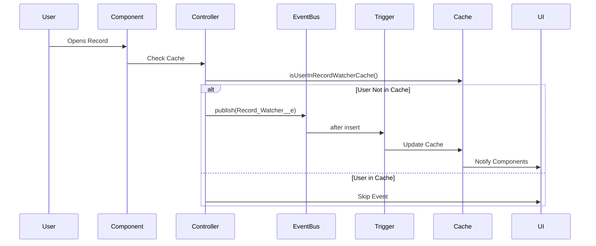

# RecordWatcher Developer Guide

## Table of Contents
1. [Getting Started](#getting-started)
2. [Code Architecture](#code-architecture)
3. [Platform Events Implementation](#platform-events-implementation)
4. [Cache Management](#cache-management)
5. [Component Development](#component-development)
6. [Performance Optimization](#performance-optimization)
7. [Debugging Guide](#debugging-guide)

## Getting Started

### Development Environment Setup

1. **Clone the Repository**
   ```bash
   git clone <repository-url>
   cd RecordWatcher
   ```

2. **Authenticate with Salesforce**
   ```bash
   sfdx auth:web:login -a RecordWatcher
   ```

3. **Deploy to Scratch Org**
   ```bash
   sfdx force:org:create -f config/project-scratch-def.json -a RecordWatcher
   sfdx force:source:deploy -p force-app/main/default
   ```

4. **Open Scratch Org**
   ```bash
   sfdx force:org:open
   ```

### Project Structure
```
RecordWatcher/
├── force-app/main/default/
│   ├── classes/                    # Apex Classes
│   ├── triggers/                   # Apex Triggers
│   ├── aura/                       # Aura Components
│   ├── lwc/                        # Lightning Web Components
│   ├── objects/                    # Custom Objects
│   └── staticresources/            # Static Resources
├── config/                         # Scratch Org Configuration
├── scripts/                        # Utility Scripts
└── manifest/                       # Package Manifest
```

## Code Architecture

### Event-Driven Architecture

The application follows an event-driven architecture pattern:



### Component Lifecycle

#### Aura Component Lifecycle
```javascript
// Component Initialization
doInit() {
    checkDefaultCachePartition()
        .then(response => {
            if (response) {
                subscribeToEvents();
                getAllTabInfo();
            }
        });
}

// Tab Focus Detection
onTabFocused() {
    updateRecordRelatedToTab();
}

// Tab Close Cleanup
onTabClosed() {
    removeRecordWatcherOrgCache();
}
```

## Platform Events Implementation

### Event Publishing

#### RecordWatcherController.updateRecordWatcher()
```apex
@AuraEnabled(cacheable=false)
public static List<Record_Watcher__e> updateRecordWatcher(
    Id recordId, String sObjType, Id userId, Boolean isWatching) {
    
    List<Record_Watcher__e> rwList = new List<Record_Watcher__e>();
    Record_Watcher__e rw = new Record_Watcher__e();
    
    rw.Record_Id__c = recordId;
    rw.sObjectName__c = recordId.getSObjectType().getDescribe().getName().replace('_','');
    rw.User_Id__c = userId;
    rw.Is_Watching__c = isWatching;
    
    rwList.add(rw);
    EventBus.publish(rwList);
    
    return rwList;
}
```

#### Event Processing Trigger
```apex
trigger RecordWatcherEventTrigger on Record_Watcher__e (after insert) {
    List<Record_Watcher__e> recordWatcherList = Trigger.New;
    
    if (!recordWatcherList.isEmpty()) {
        String formattedObjApiName = recordWatcherList[0].sObjectName__c.replace('_','');
        String key = 'RW' + formattedObjApiName + recordWatcherList[0].Record_Id__c;
        
        // Process each event
        for (Record_Watcher__e event : recordWatcherList) {
            // Update cache logic
        }
    }
}
```

### Event Subscription

#### Aura Component Subscription
```javascript
// Subscribe to platform events
subscribe() {
    const messageCallback = (response) => {
        console.log('Received platform event:', JSON.stringify(response));
        const payload = response.data.payload;
        
        if (payload.sObjectName__c === this.sObjectName &&
            payload.Record_Id__c === this.updateRecId) {
            this.refresh();
        }
    };
    
    subscribe(this.channelName, this.replayId, messageCallback)
        .then(response => {
            console.log('Subscribed to platform event channel:', response.channel);
            this.subscription = response;
        });
}
```

## Cache Management

### Cache Key Strategy
```apex
// Cache key format: RW{ObjectName}{RecordId}
String formattedObjApiName = recordId.getSObjectType().getDescribe().getName().replace('_','');
String key = 'RW' + formattedObjApiName + recordId;
```

### Cache Data Structure
```apex
public class RecordWatcher {
    public String recordId;
    public String objectApiName;
    public Map<Id,Boolean> userIdActivityMap;
}
```

### Cache Operations

#### Reading from Cache
```apex
@AuraEnabled
public static Map<String, Object> getRecordWatcher(Id recId, String objApiName, String keyParam) {
    String key = null;
    if (keyParam != null) {
        key = keyParam;
    } else {
        String formattedObjApiName = recId.getSObjectType().getDescribe().getName().replace('_','');
        key = 'RW' + formattedObjApiName + recId;
    }
    
    if (key != null) {
        Object recordWatchCache = Cache.Org.get(key);
        if (recordWatchCache != null) {
            Map<String, Object> recordWatcherMap = (Map<String, Object>)(JSON.deserializeUntyped(JSON.serialize(recordWatchCache)));
            return recordWatcherMap;
        }
    }
    return null;
}
```

#### Writing to Cache
```apex
// Update cache with new user
RecordWatcherController.RecordWatcher rw = new RecordWatcherController.RecordWatcher();
rw.objectApiName = objectApiName;
rw.recordId = recordId;
rw.userIdActivityMap = userActivityMap;
Cache.Org.put(key, rw);
```

#### Removing from Cache
```apex
// Remove user from cache
if (!userActivityMap.isEmpty()) {
    Cache.Org.put(key, rw);
} else {
    Cache.Org.remove(key);
}
```

## Component Development

### Aura Component Structure

#### Component Definition
```xml
<aura:component implements="force:hasRecordId,force:hasSObjectName,flexipage:availableForAllPageTypes,flexipage:availableForRecordHome" 
                access="global" controller="RecordWatcherController">
    
    <!-- Attributes -->
    <aura:attribute name="currentUserId" type="String"/>
    <aura:attribute name="workers" type="List"/>
    <aura:attribute name="isWorking" type="Boolean"/>
    
    <!-- Event Handlers -->
    <aura:handler name="init" value="{!this}" action="{!c.doInit}"/>
    <aura:handler event="lightning:tabFocused" action="{!c.onTabFocused}"/>
    <aura:handler event="lightning:tabClosed" action="{!c.onTabClosed}"/>
    
    <!-- UI Components -->
    <lightning:workspaceAPI aura:id="workspace"/>
    <lightning:empApi aura:id="empApi"/>
    
</aura:component>
```

#### Controller Methods
```javascript
({
    doInit: function(component, event, helper) {
        // Component initialization logic
    },
    
    getAllTabInfo: function(component, event, helper) {
        // Tab analysis logic
    },
    
    updateRecordRelatedToTab: function(component, event, helper) {
        // Record watching update logic
    }
})
```

## Performance Optimization

### Cache Optimization
```apex
// Use efficient cache key generation
String key = 'RW' + objectApiName.replace('_','') + recordId;

// Batch cache operations
Map<String, Object> cacheUpdates = new Map<String, Object>();
for (Record_Watcher__e event : events) {
    // Process events in batch
}
```

### Event Optimization
```apex
// Check cache before publishing events
Boolean isInCache = isUserInRecordWatcherCache(userId, recordId, objectApiName);
if (!isInCache) {
    // Only publish if user is not already watching
    EventBus.publish(events);
}
```

### Component Optimization
```javascript
// Debounce frequent updates
let updateTimeout;
updateRecordRelatedToTab() {
    clearTimeout(updateTimeout);
    updateTimeout = setTimeout(() => {
        // Perform update
    }, 100);
}
```

## Debugging Guide

### Debug Logs

#### Platform Event Debugging
```apex
// Add debug statements to track events
System.debug('Publishing event: ' + rwList);
System.debug('Event payload: ' + JSON.serialize(rwList));
```

#### Cache Debugging
```apex
// Monitor cache operations
System.debug('Cache key: ' + key);
System.debug('Cache data: ' + Cache.Org.get(key));
```

#### Component Debugging
```javascript
// Add console logs for component debugging
console.log('Component state:', this.workers);
console.log('Current record:', this.updateRecId);
console.log('Platform event received:', response);
```

### Debug Tools

#### Salesforce Debug Logs
1. Setup → Debug Logs
2. Create new debug log
3. Set trace flags for your user
4. Reproduce the issue
5. Download and analyze debug log

#### Browser Developer Tools
1. Open browser developer tools
2. Monitor console logs
3. Check network requests
4. Analyze component state

### Common Debug Scenarios

#### Event Not Publishing
1. Check user permissions
2. Verify platform event configuration
3. Review debug logs for errors
4. Test with minimal data

#### Cache Issues
1. Verify cache partition configuration
2. Check cache memory allocation
3. Monitor cache hit/miss ratios
4. Review cache key generation

#### Component Not Updating
1. Check event subscription
2. Verify component lifecycle
3. Review browser console errors
4. Test component isolation

### Performance Monitoring

#### Cache Performance
```apex
// Monitor cache usage
Set<String> cacheKeys = Cache.Org.getKeys();
System.debug('Cache keys count: ' + cacheKeys.size());
```

#### Event Volume
```apex
// Monitor event publishing frequency
System.debug('Events published in this transaction: ' + Limits.getPublishImmediateDML());
```

#### Component Performance
```javascript
// Monitor component render performance
console.time('componentUpdate');
// Component update logic
console.timeEnd('componentUpdate');
```

---

**Note**: This developer guide provides comprehensive technical details for implementing and maintaining the RecordWatcher application. For additional support, refer to the main README.md file. 